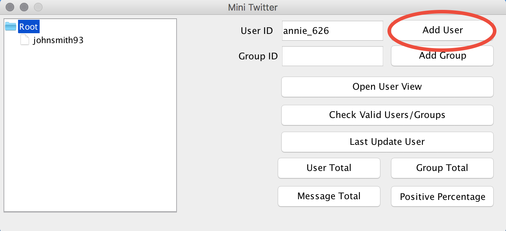
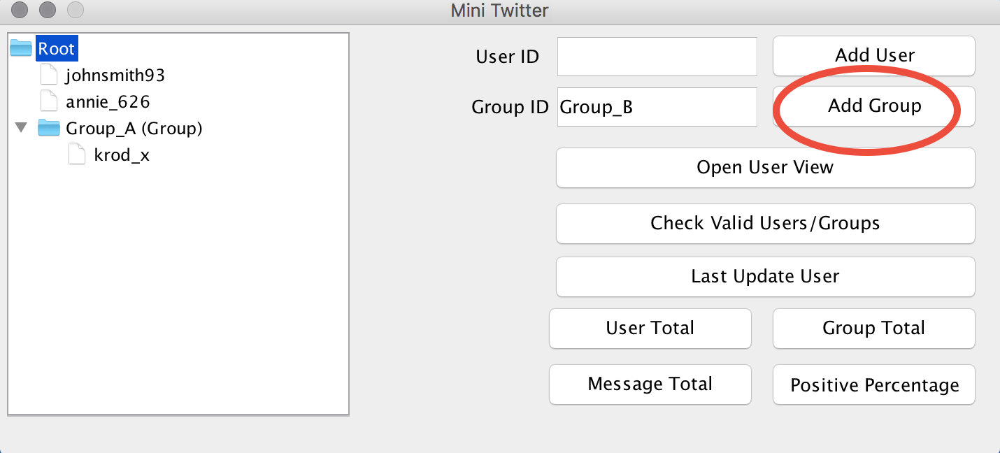
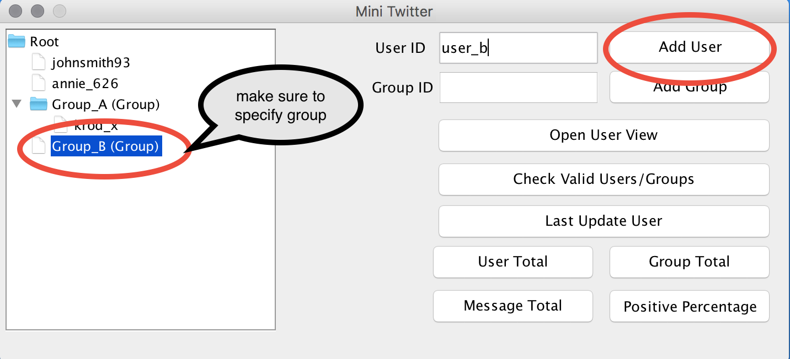
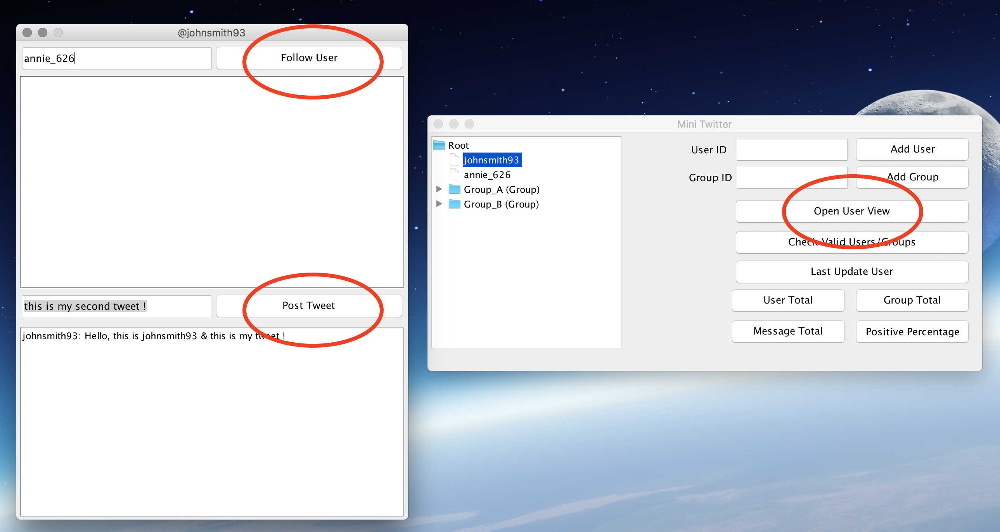
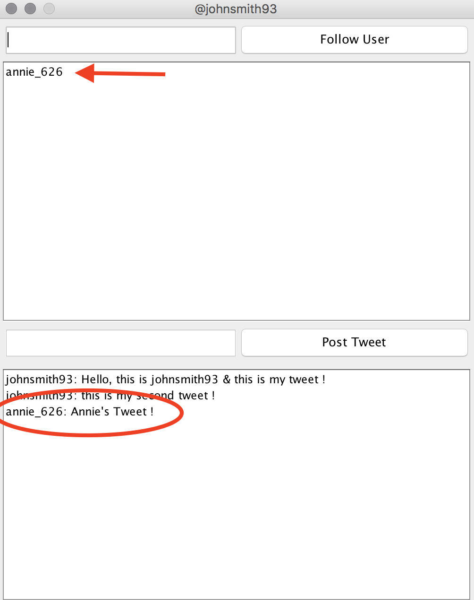
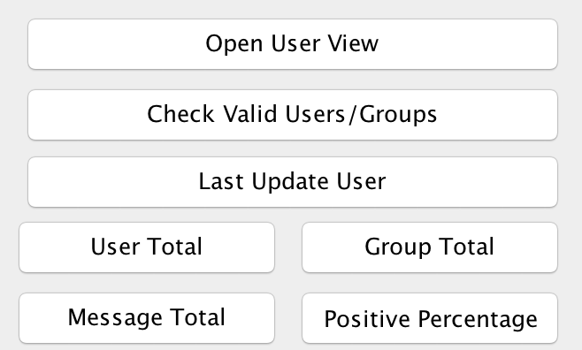

# Mini Twitter

## Table of Contents
1. [ Description. ](#desc)
2. [ Creating a Social Network Simulation. ](#simulation)
3. [ Additional Features. ](#features)

## Project Description
MiniTwitter is an admin control panel that recreates functioning Twitter user-facing behavior via a desktop application (Java Swing). The main objective of this application is to showcase multiple design patterns applied in Social Networking Services.

## Design Patterns Applied
* Singleton
* Observer
* Visitor
* Composite

## Creating a Social Network Simulation

### Adding by User or Groups to Network

### Adding User to Specified Group

### User View

 * Opening User View : Opens the user profile.
 * Following User : Showcases which users the current user is following. By following a 
   user, the current user will recieve that persons tweets.
 * Post Tweet : Self explanatory, a posted tweet will be distrubted throughout the 
   followers within the nework.

## Additional Features

* Last Update User: Displays the time and date the last update was made in the network by 
  a user.
* User Total: Calculates user total in the network.
* Group Total: Calculates group total in the network.
* Message Total: Calculates message total in the network.
* Positive Percentage: Determines whether a tweet shows positivity based on a list of 
  keywords.

